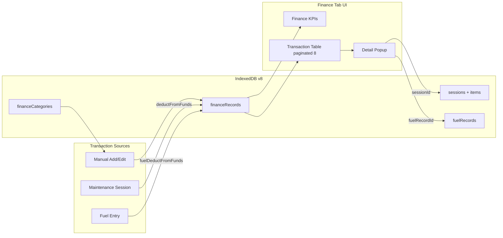

# Finance Tab Completion Plan

## Current state (audit)

Much of the finance foundation exists in [`js/script.js`](js/script.js) and [`index.html`](index.html), but several user-facing pieces are incomplete or broken:

| Your requirement | Current state |
|---|---|
| Finance category management | **Missing** — no `financeCategories` store, no Settings UI; add-transaction uses a hardcoded `<select>` |
| Description fallback to category | **Blocked** — `saveFund()` requires source and shows an alert |
| Table date column + action buttons | Actions exist in JS but screenshot shows empty column; date has no narrow width; `financePerPage = 5` (not 8) |
| Add funds / spending / withdrawal | **Income only** — no transaction type selector; popup titled "Add Funds" |
| Maintenance in transaction history | **Partial** — `addMaintenanceExpense()` on new sessions when `deductFromFunds` checked; click shows generic popup, not session UI |
| Fuel in transaction history | **Partial** — `addFuelExpense()` when `fuelDeductFromFunds` checked; fuel edit always re-adds finance even if unchecked (bug) |
| Pagination 8 + prev/next | Controls exist; per-page is **5** |
| License expiry colored border | Logic applies `license-warning-*` classes but base `.license-expiry-box` has `border: 0px` — border never visible |
| KPI uniform borders | Uses `::before` 4px **top-only** accent, not full border |
| Row click details | Basic `viewTransactionDetails()` — no maintenance/fuel rich views |
| Danger zone descriptions + orange toggles | Red toggle styling; no per-action descriptions |
| Export/import | `financeRecords` included; **`financeCategories` not** (store doesn't exist yet) |

---

## Architecture

---

## Implementation plan

### 1. Database: `financeCategories` store (v8 migration)

**File:** [`js/database.js`](js/database.js)

- Bump `DB_VERSION` to **8**
- Add `financeCategories` store: `{ id, name, color }` with unique `name` index
- Seed defaults on upgrade: Savings, Salary, Bonus, Refund, Maintenance, Fuel, Insurance, Tolls, Other (with colors)
- Add `fuelRecordId` index on `financeRecords` for faster linked deletes
- Update `checkDatabaseHealth`, `resetAllData`, selective-delete store lists to include `financeCategories`
- Add `deleteFinanceData()` behavior note: clears records only; categories remain (or offer separate option)

### 2. Finance Category Management UI (Settings)

**File:** [`index.html`](index.html) — new section after existing Category Management (mirror structure):

- Inputs: `#newFinanceCategoryName`, `#newFinanceCategoryColor`
- Buttons: `#addFinanceCategoryBtn`, `#restoreDefaultFinanceCategoriesBtn`
- List: `#financeCategoriesList` with pagination controls (5 per page, same as maintenance categories)

**File:** [`js/script.js`](js/script.js) — clone maintenance category pattern:

- `loadFinanceCategoriesList()`, `renderFinanceCategoriesPage()`, `changeFinanceCategoryPage()`
- Add / edit / delete / restore-default handlers
- Extend shared `openCategoryEditPopup()` / `saveCategoryEdit()` with `editCategoryMode = 'finance'` (or parallel functions if simpler)
- On category delete: warn that existing transactions keep the old category name string

**File:** [`css/style.css`](css/style.css) — reuse `.categories-list`, `.category-edit-btn`, pagination classes (no new component needed)

### 3. Add Transaction modal (income / expense)

**File:** [`index.html`](index.html) — update `#addFundsPopup`:

- Title/button: **"Add Transaction"** (not "Add Funds")
- Add `#fundType` select: **Income (Add Funds)** | **Expense (Spending / Withdrawal)**
- Category `<select>` populated dynamically from `financeCategories` (filter income vs expense categories by name heuristics or show all — simplest: show all categories)

**File:** [`js/script.js`](js/script.js):

- `openAddFundsPopup()` — reset form, set today's date, load categories into dropdown from DB
- `saveFund()`:
  - `type` from `#fundType` (`income` | `expense`)
  - `description = source.trim() || category` (no alert if empty)
  - `categoryColor` from selected `financeCategories` record (not hardcoded map)
- `saveTransactionEdit()` — same description fallback; replace free-text category with dropdown; optionally allow type change for manual records only

### 4. Transaction History table

**Files:** [`css/style.css`](css/style.css), [`js/script.js`](js/script.js)

- Set `financePerPage = 8`
- Date column: add `.finance-table .col-date` — `width: 90px; white-space: nowrap`
- Actions column: ensure `.actions-cell` visible on desktop; verify `record.id` is numeric in `onclick` handlers
- Whole `<tr>` clickable (`cursor: pointer`, `onclick` on row, `stopPropagation` on action buttons)
- Action button rules:
  - **Manual records** (`!sessionId && !fuelRecordId`): Edit + Delete
  - **Linked maintenance/fuel**: Delete only (or Edit opens source record edit) — recommend Delete finance entry + row click for view; deleting linked row warns it does **not** delete the session/fuel entry
- Type column: show **Income** or **Expense** (withdrawal/spending both = Expense per your choice)
- Row hover affordance (subtle highlight already exists)

### 5. Rich transaction detail popup

**File:** [`js/script.js`](js/script.js) — rewrite `viewTransactionDetails(recordId)`:

| Record type | Detail content |
|---|---|
| Manual income/expense | Current fields + notes, formatted amount, category badge |
| `sessionId` set | Reuse `displaySessionDetails()` HTML inside `#transactionDetailsPopup` (or open `#viewDetailsModal`) — session info, item cards, total |
| `fuelRecordId` set | Load fuel record; show date, odometer, liters, price/L, total, full-tank flag, notes |
| Fallback | Generic view if linked source was deleted |

Add "View in Maintenance" / "View in Fuel" link buttons when linked.

### 6. Maintenance + fuel sync fixes

**File:** [`js/script.js`](js/script.js)

- **Session edit sync:** In `saveSession()` edit branch (`editingSessionId`), after items saved:
  - If `deductFromFunds` && total > 0: update existing finance record by `sessionId` or create if missing
  - If unchecked: `deleteFinanceRecordsBySession(sessionId)`
- `addMaintenanceExpense()` — use finance category **"Maintenance"** color from `financeCategories` store

**File:** [`js/fuel-analytics.js`](js/fuel-analytics.js)

- Fuel edit: only delete/re-add finance record when `formData.deductFromFunds` is true (fix current always-add bug)
- `addFuelExpense()` — resolve Fuel category color from `financeCategories`

### 7. Finance KPI card styling

**File:** [`css/style.css`](css/style.css)

- Remove top-only `::before` accent bars on `.finance-kpi-card`
- Apply **uniform 2px border** on all sides per card type (match existing color palette: green savings, blue income, red expenses, amber balance)
- Keep icon `::after`, hover lift, responsive grid breakpoints
- Optional: color Net Balance value green/red based on sign

### 8. License expiry border

**Files:** [`css/style.css`](css/style.css), [`js/script.js`](js/script.js)

- Base `.license-expiry-box`: `border: 2px solid var(--border-light)`
- State classes (already applied in `renderCarInfo()`):
  - `license-warning-soon` — amber border + light amber bg
  - `license-warning-urgent` / `license-warning-expired` — red border + light red bg
  - Safe (>30 days): green or neutral border via new `license-warning-safe` class

### 9. Danger Zone UX

**File:** [`index.html`](index.html)

Add short descriptions under each destructive action:

- Delete Database — when DB is corrupted
- Selective delete — what each store contains (Fuel Records, Fuel Sessions, Finance Records, Sessions)
- Delete Selected — backup behavior
- Undo — restores last selective backup
- Reset All — wipes everything

**File:** [`css/style.css`](css/style.css)

Update `.selective-store-btn`:

- Default (unselected): light orange bg (`#ffedd5`), dark text
- `.active` (selected): solid orange (`#f97316`), white text
- Remove current red danger styling from toggle buttons (keep red for actual delete execute buttons)

### 10. Export / import

**File:** [`js/script.js`](js/script.js)

- `exportAllDataInternal()` — read `financeCategories`, include in JSON payload
- `importDataInternal()` — clear + re-import `financeCategories` when present
- `renderAll()` — call `loadFinanceCategoriesList()` on settings load; refresh finance dropdowns after import

---

## What you may have missed (gaps to address)

These are worth fixing in the same pass:

1. **Session edit → finance sync** — editing a maintenance session today does not update its finance row
2. **Fuel edit finance bug** — fuel edit always re-creates finance record even when "deduct from funds" is unchecked
3. **"Total Savings" KPI label** — currently shows lifetime net (all income − all expenses), not Savings-category balance; consider renaming to **"Total Balance"** or **"Net Worth"**
4. **Deleting a linked finance row** — does not delete the maintenance session or fuel entry; need clear confirmation text
5. **Category color drift** — manual transactions store denormalized `category` + `categoryColor`; editing a finance category won't retroactively update old rows (acceptable, but document in UI)
6. **Finance tab stale after session save** — `renderAll()` does not call `loadFinanceRecords()` unless user is already on finance tab; add refresh when finance data changes
7. **Transaction search/filter** — maintenance history has search; finance has none (future enhancement)
8. **Selective delete missing stores** — `financeCategories` not in selective-delete toggle list (add optional toggle)
9. **Mobile table** — card layout hides Type/Category on very small screens; ensure Actions remain visible (already partially styled at `@media max-width: 575px`)

---

## Files touched (summary)

| File | Changes |
|---|---|
| [`index.html`](index.html) | Finance category section, Add Transaction modal, danger zone descriptions |
| [`js/database.js`](js/database.js) | v8 migration, `financeCategories`, `fuelRecordId` index |
| [`js/script.js`](js/script.js) | Category CRUD, transaction save/edit/view, session sync, export/import, pagination |
| [`js/fuel-analytics.js`](js/fuel-analytics.js) | Fix deduct-from-funds on fuel edit |
| [`css/style.css`](css/style.css) | Table columns, KPI borders, license border, danger zone orange toggles |

## Test checklist

- Add income without description → category name appears in Item column
- Add expense (withdrawal/spending) → shows as Expense, deducts from KPIs
- Record maintenance with deduct checked → one row in history; click opens session detail UI
- Record fuel with deduct checked → fuel row appears; click shows fuel details
- Edit maintenance session cost → finance row updates
- Edit fuel with deduct unchecked → finance row removed
- Pagination shows 8 rows; prev/next work beyond 8 records
- License expiry box shows green/amber/red border appropriately
- Finance KPI cards have uniform colored borders
- Danger zone toggles: light orange unselected, orange selected; descriptions visible
- Export JSON includes `financeCategories` + `financeRecords`; import restores both
- Mobile: table cards show actions; KPI grid stacks correctly
